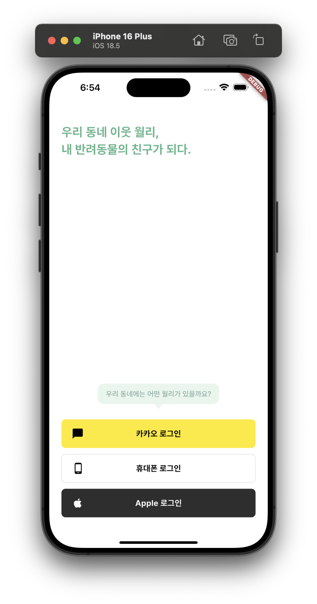
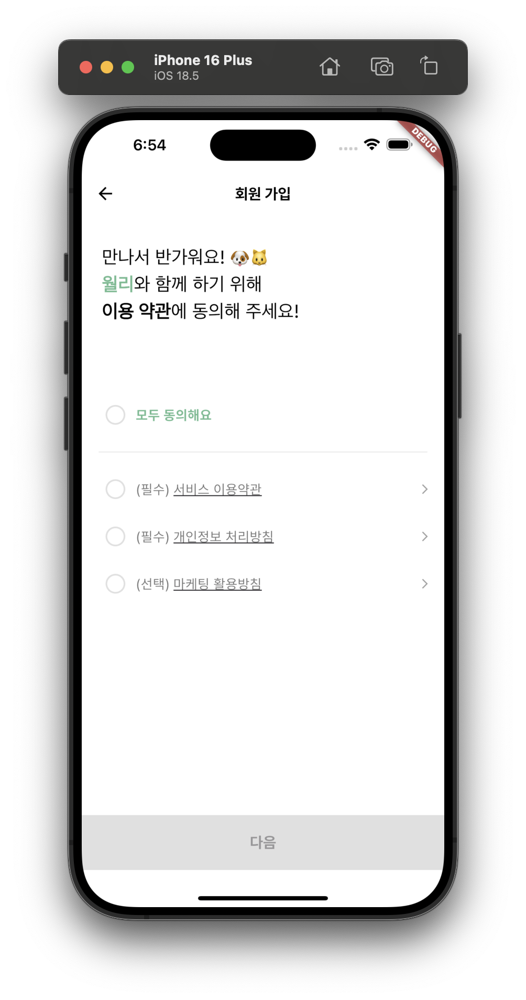
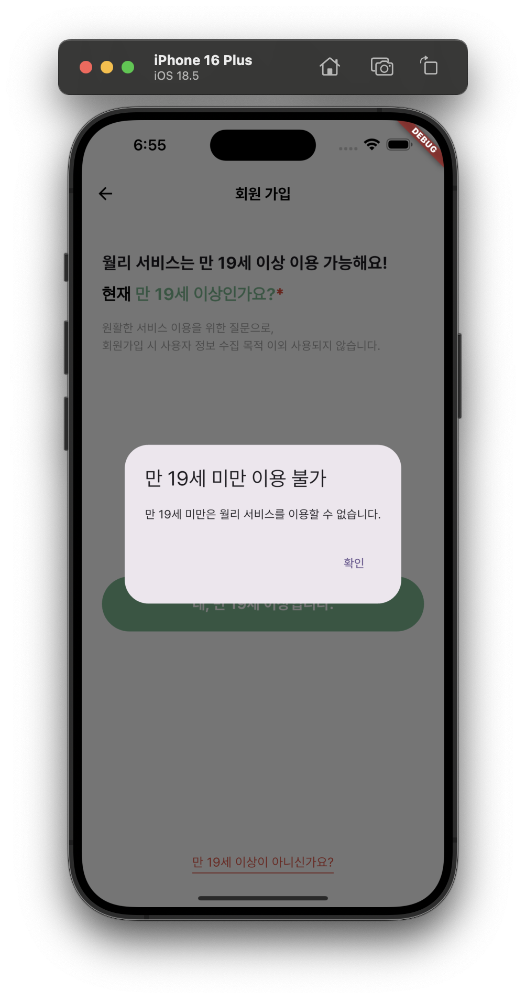
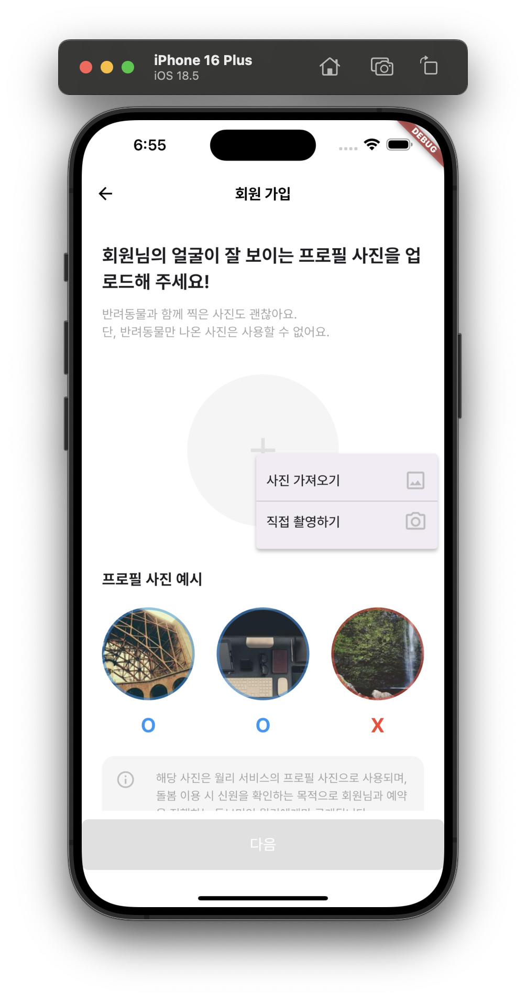

# flutter_application_2

##### 플러터 실습을 위한 프로젝트입니다.
##### 주요 기능은 다음과 같습니다.
- 소셜 로그인 구현
- 이용 약관 표시
- Alert 위젯 표시
- Navigator 활용
- 이미지 가져오기 및 편집

##### 화면 예시





## Getting Started

##### 다음과 같이 실행할 수 있습니다.
```dart
flutter pub get
flutter run
```